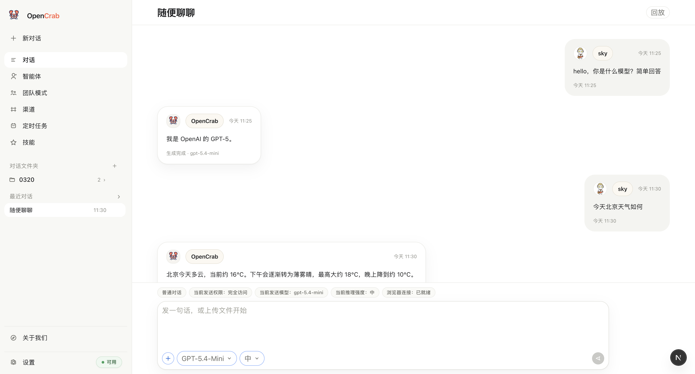
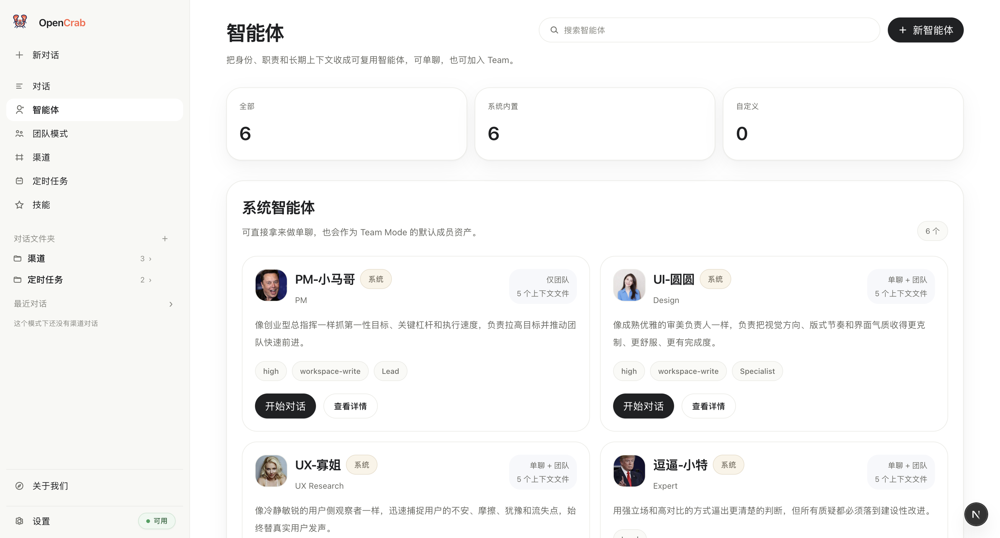
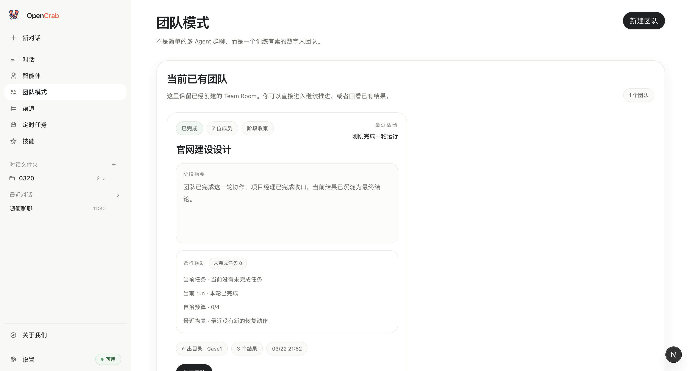
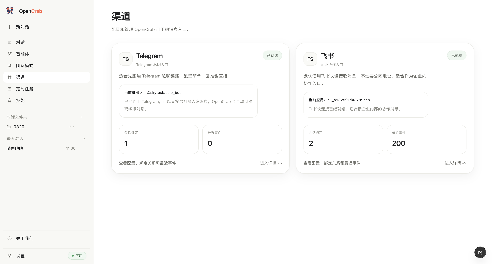
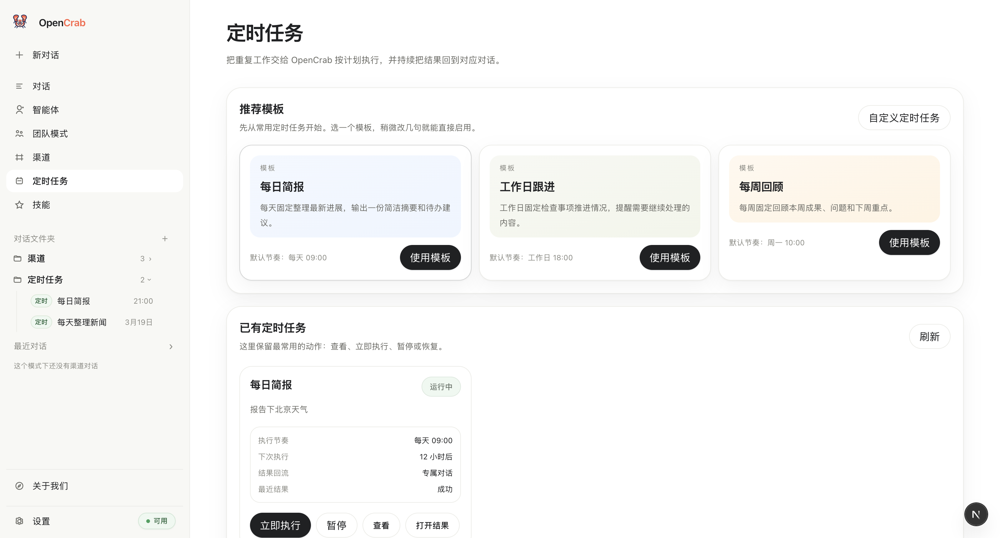
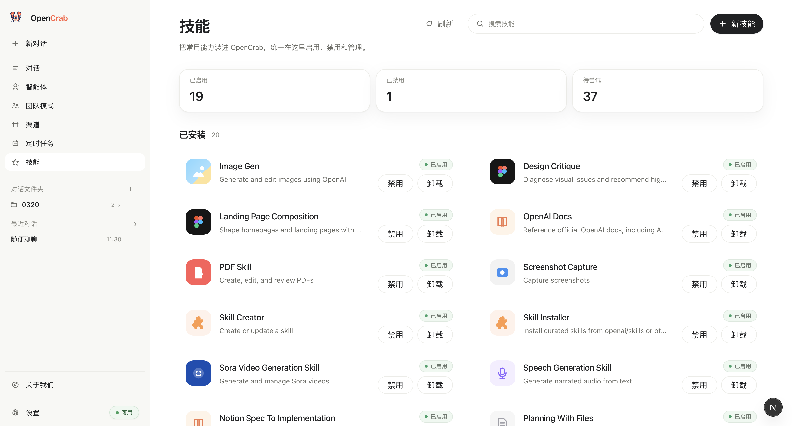

<p align="center">
  
</p>

<p align="center">
  <a href="https://github.com/KetteyMan/opencrab"></a>
  <a href="https://github.com/KetteyMan/opencrab/releases/tag/v0.1.0"></a>
  <a href="./LICENSE"></a>
  
  
  
</p>

<p align="center">
  中文 README ｜ <a href="./README-en.md">English</a>
</p>

OpenCrab 是一个中文优先、本地优先、chat-native 的开源 AI 工作台。  
当前 `OpenCrab for Mac` 已经发布，你可以直接下载桌面 App：[OpenCrab Desktop v0.1.0](https://github.com/KetteyMan/opencrab/releases/tag/v0.1.0)。

- 官网：[opencrab-ai.com](https://opencrab-ai.com)
- 联系邮箱：[sky@opencrab-ai.com](mailto:sky@opencrab-ai.com)

## 什么是 OpenCrab

### OpenCrab 是什么

- 一个面向普通用户的 AI 产品
- 一个让技术用户可以继续 DIY 的技术产品
- 一个把 `对话`、`智能体`、`Team Mode`、`Channels`、`定时任务`、`Skills` 收进同一个产品表面的工作台
- 一个当前以 macOS 为主入口、以本地优先运行时为基础的桌面 AI 工作空间

### OpenCrab 不是什么

- 不是只给工程师使用的 terminal agent shell
- 不是把 `cron`、`router`、`YAML`、`MCP`、`subagent graph` 直接甩给普通用户的控制台
- 不是一个只有聊天气泡、没有执行能力的模型壳子
- 不是一个为了“功能更多”而牺牲理解成本的产品

### 为什么我要做 OpenCrab

- 对非技术人员：
我希望 AI 产品可以像正常的用户产品一样被安装和使用。打开 Mac App、连接账户、说一句话就能开始，而不是先学习终端、环境变量、调度表达式和多智能体编排图。
- 对技术人员：
我也希望 OpenCrab 不是一个封死的黑盒。你应该可以 DIY 自己的 Agent、技能、团队流程、运行边界和产品能力。所以 OpenCrab 既是用户产品，也是技术产品。

## 如何使用 OpenCrab

### 0. 使用前提

- `Mac`
- `Google Chrome 146+`
- 可用的 `codex` 账户
当前账户体系与 ChatGPT 同源，你可以把它理解为同一个账号体系下的使用资格。
- 能访问 ChatGPT 的网络条件

### 1. 不懂技术的用户

- 推荐直接安装 mac 桌面 App，这是最适合普通用户的路径。
- 当前已发布版本：`[OpenCrab Desktop v0.1.0](https://github.com/KetteyMan/opencrab/releases/tag/v0.1.0)`
- 安装完成后，按产品内引导连接 ChatGPT / Codex，就可以开始使用。

### 2. 初学技术的用户

- 如果你会一点终端，但不想自己逐个排错，推荐直接让 Codex 帮你安装。
- 你可以把下面这段话发给 Codex：

```text
请帮我在 Mac 上安装 OpenCrab (https://github.com/KetteyMan/opencrab)。请先检查 Chrome 版本、codex 登录状态和网络条件；如果缺少依赖就补齐，然后把 OpenCrab 跑起来，并在最后告诉我应该点哪里开始使用。
```

- 这条路径适合“愿意学一点技术，但不想独自踩坑”的用户。

### 3. 资深技术的用户

- 你可以直接从 Git 安装、运行和修改 OpenCrab。
- 详细说明见：[从 Git 安装 OpenCrab](./docs/engineering/install-from-git.md)
- 如果你只想快速启动，最短路径通常是：

```bash
git clone https://github.com/KetteyMan/opencrab.git
cd opencrab
npm install
cp .env.example .env.local
npm run desktop:dev
```

## OpenCrab 的产品设计哲学

### 1. 一切非技术人员无法理解的内容，永远不允许出现在用户交互中

如果一个概念必须先学会 `cron`、`MCP`、`sandbox`、`router`、`worktree` 才能用，那它就不该直接暴露给普通用户。  
技术复杂度可以存在，但必须被产品吸收，而不是转嫁给用户。

### 2. 不求产品广度，但求产品深度

OpenCrab 不追求“每个方向都浅浅做一点”。  
我更在意把真正重要的能力做深，尤其是 `Team Mode`。

我的目标不是让一个人同时管理十个玩具 demo，而是让一个人真的能开启 `10` 个公司，并且都赚到钱。

### 3. 我的 Blog

- [为什么 Tasks 应该持续推动工作](https://opencrab-ai.com/blog/tasks-keep-work-moving)
- [为什么 Channels 是参与层，而不是消息补充](https://opencrab-ai.com/blog/channels-are-participation)
- [为什么 Team Mode 要走到 Subagents 之外](https://opencrab-ai.com/blog/team-mode-beyond-subagents)
- [系统 Agents 如何构建长期策略](https://opencrab-ai.com/blog/system-agents-build-strategy)
- [为什么 Team Memory 和 Autonomy Gate 很重要](https://opencrab-ai.com/blog/team-memory-and-autonomy-gate)

### 4. 产品截图


| 对话页 | 智能体页 |
| --- | ---- |
|  |  |


| 团队模式页 | 渠道页 |
| ----- | --- |
|  |  |


| 定时任务页 | 技能页 |
| ----- | --- |
|  |  |


## 代码结构介绍

```text
opencrab/
  app/          Next.js 页面与 API 路由
  components/   用户界面与交互层
  lib/          shared runtime core、stores、services、integrations
  desktop/      Electron 桌面壳层
  scripts/      构建、打包、导入、运行辅助脚本
  agents-src/   系统智能体源文件
  public/       图标与静态资源
  docs/         产品、工程、博客与设计文档
  tests/        自动化测试
```

- 想改产品页面，先看 `app/` 和 `components/`
- 想改共享运行时能力，先看 `lib/`
- 想改 mac 桌面壳层，先看 `desktop/`
- 想详细了解源码安装和开发流程，先看 [从 Git 安装 OpenCrab](./docs/engineering/install-from-git.md)、[Development Guide](./docs/engineering/development.md) 和 [Docs Index](./docs/README.md)

## License

[MIT](./LICENSE)
