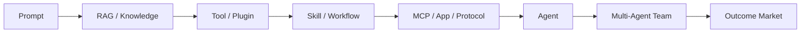
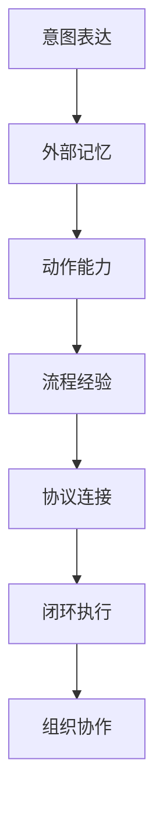
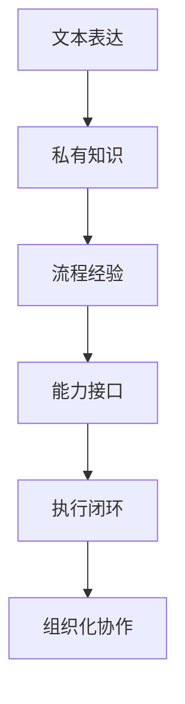
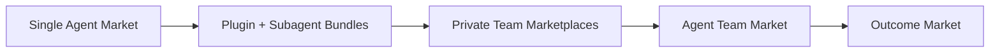

# 从提示词市场到 Agent 市场：一条正在成形的应用生态链

更新时间：2026-04-07

过去几年，LLM 世界几乎每隔一段时间就会冒出一批新名词：`Prompt`、`RAG`、`Plugin`、`Skills`、`MCP`、`Agent`、`Multi-Agent`。如果只把它们看成术语更新，很容易陷入“概念越来越多”的疲劳感；但如果换一个角度，会发现这些名词其实一直在回答同一个问题：

**AI 应用层到底在共享什么、沉淀什么、交易什么？**

我的判断是：这几年真正演进的，不只是模型能力，而是 AI 时代的“软件商品单位”。最早卖的是提示词，后来沉淀的是知识，再后来封装的是工作流与外部能力，如今开始形成的是可安装、可复用、可治理的 Agent 能力包，下一步则会进一步走向 Agent Team 与结果市场。

## 一、为什么这几年总在冒出新名词

很多人感受到的是名词爆炸，但行业真正经历的是一轮很连续的应用层升级。上一代抽象不够用了，下一代抽象才会出现。

如果把关键节点放回时间线上，这条线其实非常清楚：

| 时间 | 关键节点 | 它改变了什么 |
|---|---|---|
| 2020 | [RAG 论文](https://arxiv.org/abs/2005.11401) | 把“外部知识注入模型”系统化 |
| 2023-03 | [ChatGPT Plugins](https://openai.com/index/chatgpt-plugins/) | 模型开始从“会说”走向“能调工具” |
| 2023-11 | [GPTs](https://openai.com/index/introducing-gpts/) | Prompt、Knowledge、Actions 被封装成可分享单元 |
| 2024-01 | [GPT Store](https://openai.com/index/introducing-the-gpt-store/) | “AI 应用商店”第一次被大众化呈现 |
| 2024-05 | [Anthropic Tool Use](https://claude.com/blog/tool-use-ga) | 工具调用成为主流 agent 能力之一 |
| 2024-11 | [MCP](https://www.anthropic.com/news/model-context-protocol) | Agent 生态开始走向协议化 |
| 2025-10 | [Claude Code Plugins](https://www.claude.com/blog/claude-code-plugins/) / [Skills](https://claude.com/blog/skills) | 工作流、子代理、工具能力被打包成开发者商品 |
| 2025-10 | [Apps in ChatGPT](https://openai.com/index/introducing-apps-in-chatgpt/) | Chat 产品也开始进入 App/Agent 分发阶段 |

这些变化不是“行业喜欢重命名”，而是因为每一代商品单位都会暴露自己的边界：

- `Prompt` 能表达意图，但无法解决事实依据和执行能力。
- `RAG` 能补知识，但不能自动完成动作。
- `Plugin` 能补手脚，但常常很碎，复用起来像堆接口。
- `Skill` 能沉淀套路，但很多时候仍然依附平台。
- `Agent` 才开始真正承接“围绕目标完成任务”的闭环。

所以这不是一串孤立名词，而是一条连续的应用生态演进链。

## 二、从提示词到 Agent，真正演进的是什么

如果把这轮演进压缩成一条主路径，我会这样画：

这条路径背后的本质，不是“功能越来越多”，而是 **AI 系统在一步步接管完整工作的闭环**。

| 阶段 | 共享的核心资产 | 解决的问题 | 为什么还不够 |
|---|---|---|---|
| Prompt | 一段“怎么说”的指令 | 如何表达意图 | 太轻、易复制、易贬值 |
| RAG / Knowledge | 一套“知道什么”的上下文 | 如何让模型基于事实回答 | 知道不等于会做 |
| Tool / Plugin | 一组“能做什么”的外部能力 | 如何让模型操作系统和服务 | 接口碎片化、复用成本高 |
| Skill / Workflow | 一套“通常怎么做”的方法论 | 如何把经验固化成流程 | 常依附平台，迁移性有限 |
| MCP / App / Protocol | 一套“如何互联”的标准 | 如何接入、发现、授权、分发 | 解决互联，不直接交付结果 |
| Agent | 一个“能围绕目标完成任务”的执行体 | 如何从目标走向结果 | 单体 agent 仍受上下文、权限、可靠性约束 |
| Multi-Agent Team | 一组可协作的角色系统 | 如何处理复杂、长链路、需分工任务 | 仍缺统一的商品化与治理机制 |

把它再抽象一层，其实是在连续补齐六种能力：

也就是说，`Agent` 并不是突然冒出来的。它只是前面几层成熟之后，一个必然出现的系统级产物。

## 三、为什么市场一定会沿着这条路走

从市场视角看，这条演进线并不神秘，它其实非常符合商业规律：

**价值会持续从容易复制的东西，迁移到难以复制、难以替代、离结果更近的东西。**

| 阶段 | 看起来在卖什么 | 实际在卖什么 | 护城河强度 |
|---|---|---|---|
| Prompt 市场 | 提示词模板 | 语言技巧 | 低 |
| RAG / 知识库 | 数据接入能力 | 企业私有知识 | 中 |
| Plugin / Tool 市场 | 工具连接器 | 外部操作能力 | 中 |
| Skill 市场 | 工作套路模板 | 团队经验沉淀 | 中高 |
| Agent 市场 | 自动化助手 | 结果交付能力 | 高 |
| Multi-Agent / Team 市场 | 角色协作系统 | 组织化生产能力 | 很高 |

这背后至少有三股力量在同时推动：

| 驱动力 | 核心问题 | 带来的结果 |
|---|---|---|
| 技术驱动 | 既然模型已经理解了，为什么不能直接做完？ | 系统从回答转向执行 |
| 经济驱动 | 什么东西最不容易被复制和替代？ | 价值从 prompt 迁移到流程、集成和结果 |
| 组织驱动 | 企业到底愿意为什么长期付费？ | 付费对象从单点能力变成可治理工作单元 |

所以今天回头看，`Prompt` 更像素材，`Plugin` 更像零件，`Skill` 更像工艺，`Agent` 更像工人。整个趋势并不是在“堆能力”，而是在不断寻找 AI 时代新的软件分发单位。

## 四、为什么 Multi-Agent Team 已经出现，但市场还没真正成熟

从产品能力看，`Multi-Agent` 已经出现了；但从市场形态看，它还没有完全成熟。

原因并不复杂。单个 `Agent` 想变成公开商品，只需要“能装、能跑、能展示”；但一个 `Agent Team` 想变成真正的市场商品，还必须解决更多问题。

| 问题 | 单 Agent 尚可容忍 | Agent Team 必须解决 |
|---|---|---|
| 角色分工 | 可以模糊 | 必须明确 |
| 权限边界 | 可以粗放 | 必须隔离 |
| 协作协议 | 可以人工拼接 | 必须标准化 |
| 评测方式 | 以单点任务为主 | 需要评估整体协作效果 |
| 计费模型 | 按调用或订阅 | 需覆盖多角色、多步骤、多工具 |
| 审计与责任 | 较简单 | 必须可追溯 |

这也是为什么今天更常见的，不是“公开的 Agent Team 商店”，而是下面三种过渡状态：

| 当前形态 | 本质 | 行业现状 |
|---|---|---|
| Plugin Marketplace | 插件里可打包多个 subagents | 商品单位仍是 plugin，不是 team |
| Team Marketplace | 团队内部共享私有 agent 能力包 | 更适合先在企业内部成熟 |
| Agent Registry / Hub | 分享 agent 配置、workflow 和集成 | 更像目录和仓库，尚未完全市场化 |

如果把它画成一张成熟度图，大概会是这样：

也就是说，行业已经开始支持 `multi-agent` 协作，但还没有把“agent team”彻底标准化为一级商品。今天更多是在为这一步铺路。

## 五、Agent 之后会是什么

我对下一阶段的判断很直接：**Agent 不是终点，组织化 Agent 才是。**

未来几年更可能出现的，不是一个越来越像“全能超人”的单体 Agent，而是一组角色分明、能力互补、可治理协作的数字组织。它们会更像一个工作团队，而不是一个聊天机器人。

| 下一阶段 | 商品单位会变成什么 | 用户真正购买的是什么 |
|---|---|---|
| Agent | 单个执行体 | 一个自动化助手 |
| Agent Team | 一组协作角色 | 一套可复用的小团队 |
| Agent Organization | 带权限、审计、调度的系统 | 一层数字劳动力基础设施 |
| Outcome Market | 面向结果的服务包 | 一个被承诺的业务结果 |

如果把整个趋势压缩成一句话，我会这样写：

> 从提示词一路走到 Agent，本质上是在沿着  
> **表达意图 -> 注入上下文 -> 获得动作能力 -> 固化流程经验 -> 标准化连接生态 -> 形成执行闭环 -> 走向组织化协作 -> 最终变成结果交付**  
> 这条路径演进。

这也是我对整个 LLM 应用层最核心的理解：

**它不是在不断长出更多名词，而是在不断寻找 AI 时代新的软件分发单位。**

如果传统软件时代卖的是 `App`，那么早期 LLM 卖的是 `Prompt`，现在卖的是 `Skill / Plugin / Agent`，而未来更可能卖的是 `Agent Team` 甚至 `Outcome`。到那时，市场上最值钱的可能不再是“一个会说话的模型”，而是一套“能稳定把事做完的数字组织”。
